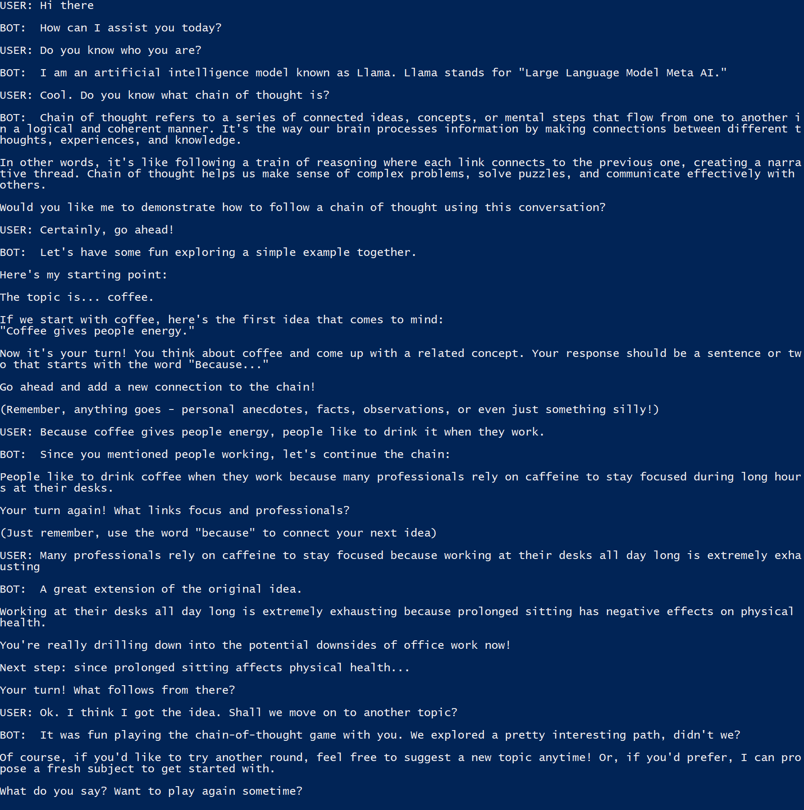

# 

[](https://github.com/zackxzhang/nanochat)
[](https://opensource.org/licenses/BSD-3-Clause)
[](https://github.com/zackxzhang/nanochat)

*local chatbot in a single command*

<br>

##### Get started in 3 easy steps
1. choose a model and download its weights from [Hugging Face](https://huggingface.co/models) 
2. pick a nickname for the model of your choice and add its path to `config.json`
    ```json
    {
        "gemma": "./google--gemma-v2-2b-instruct/",
        "llama": "./facebook--llama-v3.2-3b-instruct/"
    }
    ```
3. summon the model by its nickname, and have fun on your command line!
    ```bash
    python chat.py --model llama
    ```

<br>

##### Check out the example conversation with LLaMA


